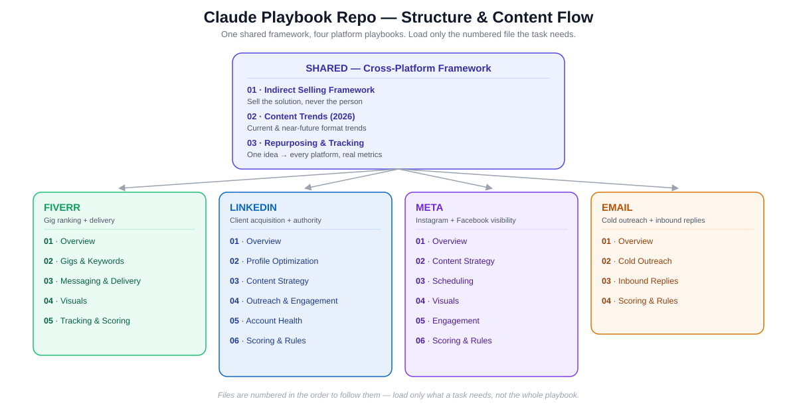

# Claude Extension Guidelines

Personal Claude playbooks for running client acquisition and content across Fiverr, LinkedIn, Meta, and Email — split into small, functionality-specific files so a task only loads what it actually needs instead of one long daily file.

## How it's organized

- **Shared/** — the cross-platform framework every other folder builds on: the indirect-selling formula, current/near-future content trends, the repurposing + proof + metrics system, and personal contact info.
- **Fiverr/**, **LinkedIn/**, **Meta/**, **Email/** — one playbook per channel, each split into numbered files (`01-`, `02-`, ...). The number is the order to follow them; `01-overview.md` in each folder explains what the rest of the files cover.

Every file starts by naming which Master Control Rules and Shared files govern it, so it can be read on its own without pulling in the whole repo.

## Handling personal info

`Shared/04-contact-info.md` holds the real email and phone number. Treat it as reference data, not content:
- Only open or use it when a task genuinely needs it (an email signature, a proposal footer, a lead who asked for direct contact)
- Never paste it into a public post, comment, caption, or connection note
- Never surface it proactively; if unsure whether a task calls for it, ask first
